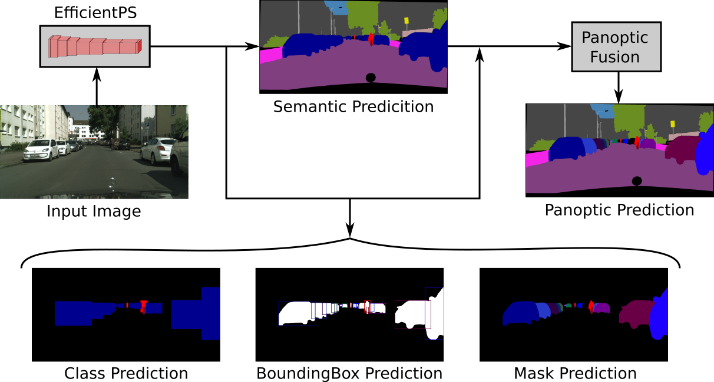

# EfficientPS: Efficient Panoptic Segmentation
[](https://paperswithcode.com/sota/panoptic-segmentation-on-cityscapes-val?p=efficientps-efficient-panoptic-segmentation) 
[](https://paperswithcode.com/sota/panoptic-segmentation-on-cityscapes-test?p=efficientps-efficient-panoptic-segmentation)
[](https://paperswithcode.com/sota/panoptic-segmentation-on-mapillary-val?p=efficientps-efficient-panoptic-segmentation)
[](https://paperswithcode.com/sota/panoptic-segmentation-on-kitti-panoptic-segmentationl?p=efficientps-efficient-panoptic)
[](https://paperswithcode.com/sota/panoptic-segmentation-on-panoptic-segmentation-on-indian-driving?p=efficientps-efficient-panoptic)

EfficientPS is a state-of-the-art top-down approach for panoptic segmentation, where the goal is to assign semantic labels (e.g., car, road, tree and so on) to every pixel in the input image as well as instance labels (e.g. an id of 1, 2, 3, etc) to pixels belonging to thing classes.



This repository contains the **PyTorch implementation** of our IJCV'2021 paper [EfficientPS: Efficient Panoptic Segmentation](https://arxiv.org/abs/2004.02307). The repository builds on [mmdetection](https://github.com/open-mmlab/mmdetection) and [gen-efficientnet-pytorch](https://github.com/rwightman/gen-efficientnet-pytorch) codebases.

If you find the code useful for your research, please consider citing our paper:
```
@article{mohan2020efficientps,
  title={Efficientps: Efficient panoptic segmentation},
  author={Mohan, Rohit and Valada, Abhinav},
  journal={International Journal of Computer Vision (IJCV)},
  year={2021}
}
```

<a href="https://github.com/opendr-eu/opendr"></a><br>
EfficientPS is also featured in the [OpenDR toolkit](https://github.com/opendr-eu/opendr).

## Demo
Samples of the results can be found on the [project website](http://panoptic.cs.uni-freiburg.de/).

## System Requirements
* Linux 
* Python 3.7
* PyTorch 1.7
* CUDA 10.2
* GCC 7 or 8

**IMPORTANT NOTE**: These requirements are not necessarily mandatory. However, we have only tested the code under the above settings and cannot provide support for other setups.

## Installation
a. Create a conda virtual environment from the provided environment.yml and activate it.
```shell
git clone https://github.com/DeepSceneSeg/EfficientPS.git
cd EfficientPS
conda env create -n efficientPS_env --file=environment.yml
conda activate efficientPS_env
```
b. Install all other dependencies using pip:
```bash
pip install -r requirements.txt
```
c. Install EfficientNet implementation
```bash
cd efficientNet
python setup.py develop
```
d. Install EfficientPS implementation
```bash
cd ..
python setup.py develop
```
## Prepare datasets
It is recommended to symlink the dataset root to `$EfficientPS/data`.
If your folder structure is different, you may need to change the corresponding paths in config files.

```
EfficientPS
├── mmdet
├── tools
├── configs
└── data
    └── cityscapes
        ├── annotations
        ├── train
        ├── val
        ├── stuffthingmaps
        ├── cityscapes_panoptic_val.json
        └── cityscapes_panoptic_val
```
The cityscapes annotations have to be converted into the aforementioned format using
`tools/convert_datasets/cityscapes.py`:
```shell
python tools/convert_cityscapes.py ROOT_DIRECTORY_OF_CITYSCAPES ./data/cityscapes/
cd ..
git clone https://github.com/mcordts/cityscapesScripts.git
cd cityscapesScripts/cityscapesscripts/preparation
python createPanopticImgs.py --dataset-folder path_to_cityscapes_gtFine_folder --output-folder ../../../EfficientPS/data/cityscapes --set-names val
```

## Training and Evaluation
### Training Procedure
Edit the config file appropriately in configs folder.
Train with a single GPU:
```
python tools/train.py efficientPS_singlegpu_sample.py --work_dir work_dirs/checkpoints --validate 
```
Train with multiple GPUS:
```
./tools/dist_train.sh efficientPS_multigpu_sample.py ${GPU_NUM} --work_dir work_dirs/checkpoints --validate 
```
* --resume_from ${CHECKPOINT_FILE}: Resume from a previous checkpoint file.
### Evaluation Procedure
Test with a single GPU:
```
python tools/test.py efficientPS_singlegpu_sample.py ${CHECKPOINT_FILE} --eval panoptic
```
Test with multiple GPUS:
```
./tools/dist_test.sh efficientPS_multigpu_sample.py ${CHECKPOINT_FILE} ${GPU_NUM} --eval panoptic
```

## Pre-Trained Models
| Dataset   |  Model | PQ |
|-----------|:-----------------:|--------------|
| Cityscapes| [Download](https://www.dropbox.com/s/zihqct9zum8eq66/efficientPS_cityscapes.zip?dl=0) | 64.4 |
|    KITTI  | [Download](https://www.dropbox.com/s/4z3qiaew8qq7y8n/efficientPS_kitti.zip?dl=0) | 42.5| 

## Additional Notes:
   * tool/cityscapes_inference.py: saves predictions in the official cityscapes panoptic format.
   * tool/cityscapes_save_predictions.py: saves color visualizations.
   * We only provide the single scale evaluation script. Multi-Scale+Flip evaluation further imporves the performance of the model.
   * This is a re-implementation of EfficientPS in PyTorch. The performance of the trained models might slightly differ from the metrics reported in the paper. Please refer to the metrics reported in [EfficientPS: Efficient Panoptic Segmentation](https://arxiv.org/abs/2004.02307) when making comparisons.

## Acknowledgements
We have used utility functions from other open-source projects. We especially thank the authors of:
- [mmdetection](https://github.com/open-mmlab/mmdetection)
- [gen-efficientnet-pytorch](https://github.com/rwightman/gen-efficientnet-pytorch)
- [seamseg](https://github.com/mapillary/seamseg.git)

## Contacts
* [Abhinav Valada](https://rl.uni-freiburg.de/people/valada)
* [Rohit Mohan](https://github.com/mohan1914)

## License
For academic usage, the code is released under the [GPLv3](https://www.gnu.org/licenses/gpl-3.0.en.html) license. For any commercial purpose, please contact the authors.

